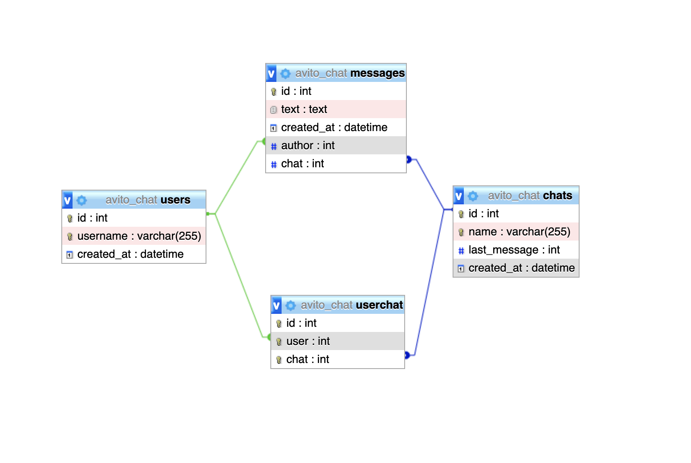

# Тестовое задание на позицию стажера-бекендера Avito

В данном проекте неободимо было чат-сервер, предоставляющий HTTP API для работы с чатами и сообщениями пользователя.
Чат был реализован на Node JS с ORM Sequelize, в качестве базы данных используется MYSQL.

## Запуск приложения
docker-compose up

## Основные сущности

## User
Пользователь приложения. Имеет следующие свойства:

* **id** - уникальный идентификатор пользователя (может быть как числом, так и строковым – как удобнее)
* **username** - уникальное имя пользователя
* **created_at** - время создания пользователя

## Chat
Отдельный чат. Имеет следующие свойства:

* **id** - уникальный идентификатор чата
* **name** - уникальное имя чата
* **users** - список пользователей в чате, отношение многие-ко-многим
* **created_at** - время создания

## Message
Сообщение в чате. Имеет следующие свойства:

* **id** - уникальный идентификатор сообщения
* **chat** - ссылка на идентификатор чата, в который было отправлено сообщение
* **author** - ссылка на идентификатор отправителя сообщения, отношение многие-к-одному
* **text** - текст отправленного сообщения
* **created_at** - время создания

## Структура таблицы

